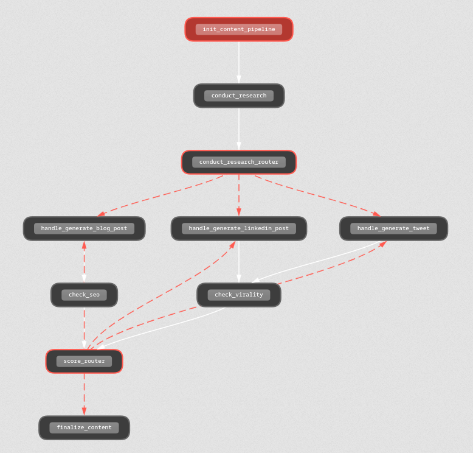

# Content Pipeline Agent 🚀

An AI-powered content generation pipeline built with [CrewAI](https://crewai.com) that creates high-quality blog posts, tweets, and LinkedIn posts with automated SEO and virality optimization.

## Demo

https://github.com/user-attachments/assets/c81b449b-ef6c-4d9b-bbf5-55ef09b3e4aa


## 📋 Overview

This project implements a multi-agent content pipeline that:

1. **Researches** your topic using web search
2. **Generates** content (blog posts, tweets, or LinkedIn posts)
3. **Evaluates** content quality (SEO for blogs, virality for social media)
4. **Regenerates** content if it doesn't meet quality thresholds
5. **Finalizes** optimized content ready for publication

## 🏗️ Architecture


## 🤖 AI Crews

### 1. Research Crew (`research_crew.py`)
- **Agent**: Head Researcher
- **Task**: Conducts web searches to gather relevant information on the topic
- **Tools**: Firecrawl web search

### 2. SEO Crew (`seo_crew.py`)
- **Agent**: SEO Specialist
- **Task**: Analyzes blog posts for SEO optimization
- **Output**: Score (0-10) with detailed reasoning

### 3. Virality Crew (`virality_crew.py`)
- **Agent**: Social Media Virality Expert
- **Task**: Analyzes tweets/LinkedIn posts for viral potential
- **Output**: Score (0-10) with actionable feedback

## 📁 Project Structure

```
content-pipeline-agent/
├── main.py              # Main flow orchestration
├── research_crew.py     # Research agent and tasks
├── seo_crew.py          # SEO analysis crew
├── virality_crew.py     # Virality analysis crew
├── tools.py             # Web search tool (Firecrawl)
├── app.py               # Flask web application
├── templates/
│   └── index.html       # Web UI template
├── static/
│   └── style.css        # Minimal black & white theme
├── pyproject.toml       # Project dependencies
├── uv.lock              # Locked dependencies
└── README.md            # This file
```

## 🛠️ Prerequisites

- Python 3.13+
- [uv](https://github.com/astral-sh/uv) (recommended) or pip
- OpenAI API key
- Firecrawl API key

## 🚀 Getting Started

### Step 1: Clone the Repository

```bash
git clone https://github.com/rawnakjain/contricrew-content-pipeline-agent.git
cd conticrew-content-pipeline-agent
```

### Step 2: Install Dependencies

Using `uv` (recommended):
```bash
uv sync
```

Or using pip:
```bash
pip install -r requirements.txt
```

### Step 3: Set Up Environment Variables

Create a `.env` file in the project root:

```env
OPENAI_API_KEY=your_openai_api_key_here
FIRECRAWL_API_KEY=your_firecrawl_api_key_here
```

### Step 4: Run the Application

#### Option A: Web Interface (Recommended)

Start the Flask web application:

```bash
python app.py
```

Open your browser and navigate to:
```
http://localhost:5000
```

1. Enter your **topic** (e.g., "The Future of AI in Content Creation")
2. Select **content type** (Blog Post, Tweet, or LinkedIn Post)
3. Click **Generate Content**
4. Wait for the AI to research, generate, and optimize your content

#### Option B: Command Line

Edit `main.py` to set your desired inputs:

```python
flow = ContentPipelineFlow()
flow.kickoff(inputs={
    "content_type": "blog_post",  # or "tweet" or "linkedin_post"
    "topic": "Your Topic Here"
})
```

Run the flow:

```bash
python main.py
```

## 📊 Content Types

| Type | Description | Quality Check |
|------|-------------|---------------|
| `blog_post` | Full blog with title, subtitle, and sections | SEO Score |
| `tweet` | Short-form content with hashtags | Virality Score |
| `linkedin_post` | Professional post with hook and CTA | Virality Score |

## 🔄 How the Quality Loop Works

1. Content is generated based on research
2. Quality checker evaluates the content (SEO or Virality)
3. If score >= 5: Content passes ✅
4. If score < 5: Content is regenerated with improvements 🔄
5. Loop continues until quality threshold is met

## 📝 Output Examples

### Blog Post
```json
{
  "title": "The Future of AI in Content Creation",
  "subtitle": "How artificial intelligence is revolutionizing...",
  "sections": [
    "Section 1: Introduction to AI Content...",
    "Section 2: Current Applications...",
    "Section 3: Future Predictions..."
  ]
}
```

### Tweet
```json
{
  "content": "AI is transforming content creation! 🚀 From automated writing to personalized recommendations...",
  "hashtags": "#AI #ContentCreation #FutureTech"
}
```

### LinkedIn Post
```json
{
  "hook": "What if I told you AI could write your next viral post?",
  "content": "The landscape of content creation is changing rapidly...",
  "call_to_action": "What's your experience with AI tools? Share below! 👇"
}
```

## 🎨 Web Interface

The web application features a minimal black and white theme with:
- Clean, modern design
- Real-time loading indicators
- Score badges (SEO/Virality)
- Formatted content display
- Error handling

## 🔧 Configuration

### Adjusting Quality Threshold

In `main.py`, modify the `score_router` method:

```python
if score.score >= 5:  # Change this threshold (0-10)
    return "check_passed"
```

### Changing the LLM Model

In `main.py`, update the model in content generation methods:

```python
llm = LLM(model="gpt-4", response_format=BlogPost)  # Change model here
```

## 🐛 Troubleshooting

### Common Issues

1. **"Invalid content type" error**
   - Ensure `content_type` is one of: `blog_post`, `tweet`, `linkedin_post`

2. **"Topic cannot be empty" error**
   - Provide a non-empty topic string

3. **API key errors**
   - Verify your `.env` file contains valid API keys
   - Ensure `python-dotenv` is loading the environment variables

4. **CrewAI event bus warnings**
   - These are harmless internal warnings and don't affect functionality

### Debug Mode

Run Flask in debug mode for detailed error messages:

```bash
FLASK_DEBUG=1 python app.py
```

Built with ❤️ using [CrewAI](https://crewai.com) and [Flask](https://flask.palletsprojects.com/)

